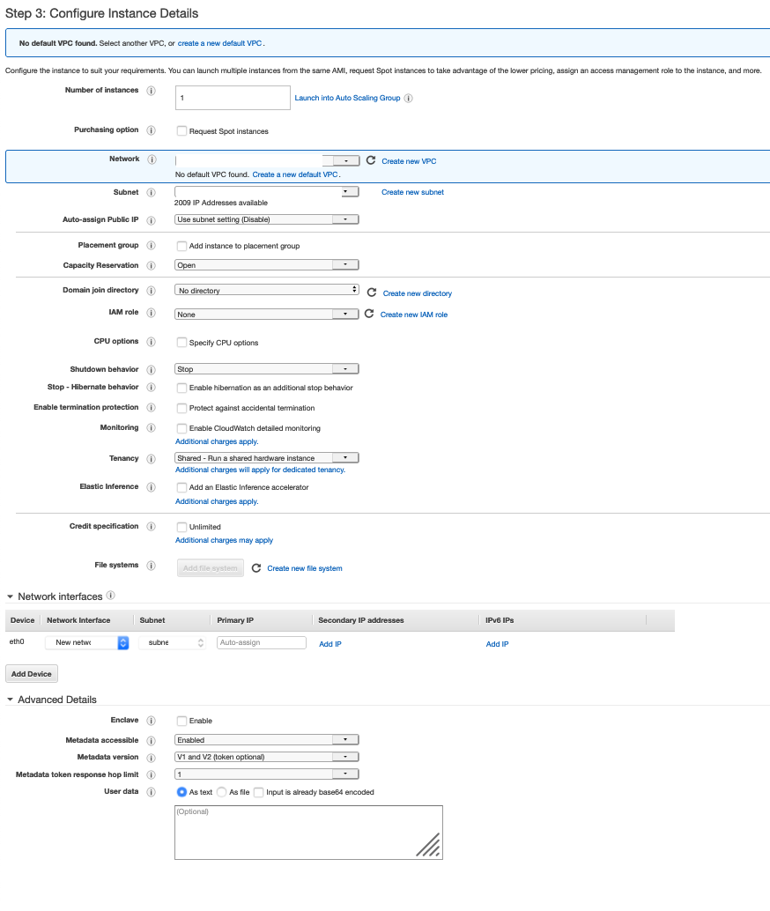
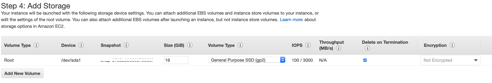
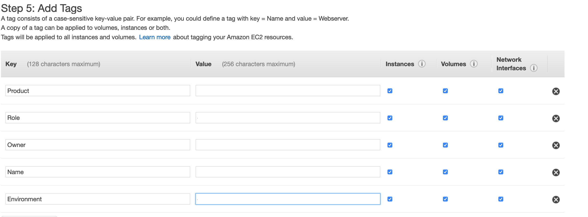
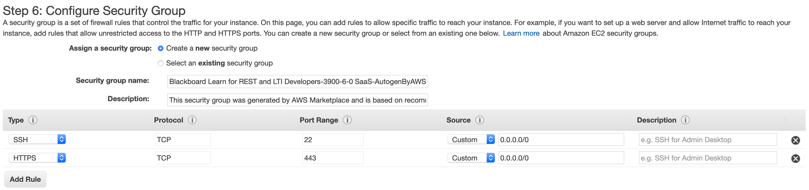

# Blackboard Learn API setup with AWS (EC2)

This is a guide to setup a Blackboard Learn instance and use it with REST APIs. This process includes 3 steps.

* [Setting up Blackboard AMI EC2 instance on AWS.](#1)
* [Setting up Blackboard developer account.](#2)
* [Linking Blackboard Learn instance and developer account.](#3)


## <a name="1"></a>Setting up Blackboard AMI EC2 instance on AWS 

1. Login to AWS console.
2. Make sure you select appropriate region and role (if you have one setup).
3. Search for and select `EC2` service from search.
4. Navigate to `Instances > Launch Instance`.
    * Step 1: Choose an Amazon Machine Image (AMI)  
        * Select `AWS Marketplace` from the left panel.
        * Search for "blackboard learn" and choose `Blackboard Learn for REST and LTI Developers` from the results.
        * Hit `Continue`.
    * Step 2: Choose an Instance Type
        * As of January 29, 2021, only `t2.large` and `t2.xlarge` instance types are supported. Select `t2.large`. Hit `Next: Configure Instance Details`.
    * Step 3: Configure Instance Details
    
    * Step 4: Add Storage
    
    * Step 5: Add Tags
    
    * Step 6: Configure Security Groups
    
    * Step 7: Review Instance Launch
        * Hit `Launch`.
        * Select an existing key pair or create a new key pair
            * Note that if you select `Choose an existing key pair`, make sure you already have the private key or select `Create a new key pair` and download the private key and save it in a secure location since this will be used to SSH into the instance.
        * Hit `Launch Instances.
5. Your Blackboard instance should be up and running in few minutes.


## <a name="2"></a>Setting up Blackboard developer account 

1. Go to [https://developer.blackboard.com/](https://developer.blackboard.com/) 
2. Signup and Create New Account. 

## <a name="3"></a>Linking Blackboard Learn instance and developer account 

### Register your Blackboard Learn instance 

1. Go to [https://developer.blackboard.com/](https://developer.blackboard.com/) 
2. Login with your account details from [previous step](#2). 
3. Under `Manage Your Applications`, choose `Register`. 
4. Register a New Application    
    * Application Name: blackboard-learn-test
    * Description: Blackboard Learn Test
    * Domain: <- Private IP from your EC2 instance ->
    * Group: Select default one.
    * Hit `Register application and generate API key`.
    * **IMPORTANT:** Make sure to save `Application Key`, `Secret Key`, and `Application ID` in a secure location. We need this information for the next step.
  
### Connect your application to Blackboard Learn instance 
  
1. Go to `https://<-Private IP from your EC2 instance ->/` 
2. Accept risk and continue 
3. Login with
    * USERNAME: `Administrator`
    * PASSWORD: `<- Your EC2's Instance ID ->`
4. Navigate to `System Admin > Integrations > REST API Integrations > Create Integration` 
5. Create Integrations    
    * Application ID: `<- Application ID from Registration above ->`
    * Learn User: `<- Choose a user. Preferably not Administrator. ->`
    * Leave everything else as is.
    * Hit `Submit`
6. Now, everything is set to start making API calls. See below how to. 
  
  
# Making REST API calls

In order to make calls to the Blackboard Learn REST API, we need to authenticate. 

## Authentication

### Generate Basic Token 

1. Base 64 encode `<Application ID>:<Applciation Secret>`
2. The encoded string is your Basic Token.

### Generate Bearer Token

1. POST `https://<- Private IP from your EC2 instance ->/learn/api/public/v1/oauth2/token`
2. Headers
    * *Content-Type:* `application/x-www-form-urlencoded`
    * *Authorization*: `Basic <- Basic Token from previous step ->`
3. Form body
    * `grant_type=client_credentials`
4. Expected response:
```json {   "access_token": "2fcz5vM1123456789MQqKQ4YEBd6yFdy3",   "token_type": "bearer",   "expires_in": 3599 } ```

Now, we use this Bearer Token to make requests. See below how to.

## Requests

### Your First Request

1. GET `https://<- Private IP from your EC2 instance ->/learn/api/public/v1/announcements`
2. Headers
    * Content-Type: application/json
    * Authorization: Bearer <- Bearer Token from above ->
3. Expected response:
```json {   "results": [] } ```

### And more...

See [Blackboard REST API Docs](https://developer.blackboard.com/portal/displayApi/Learn?version=3800.0.0) for more information.

### Gotchas

1. You may face with invalid certificate issue. You can avoid this by setting up a load balancer for your EC2 instance and attaching a certificate to it.

### Improvements

1. You can setup a custom domain using Route 53 on AWS so you don't have to use your EC2 instance's Private IP every time.
2. Infrastructure as code - Make this setup a CloudFormation stack (EC2 + ALB + SG) so it is easier to manage the instance including launching on demand.
